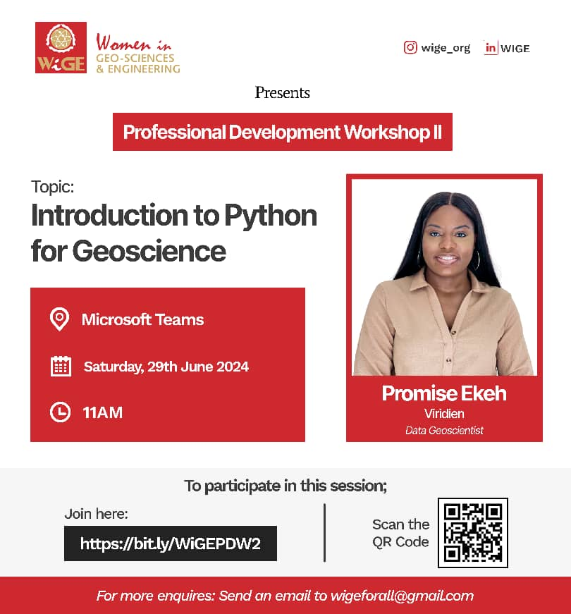

# Women in Geoscience & Engineering (WIGE)

Facilitator: Promise Ekeh

Date: 29th June 2024

***
# About Event
Are you a geoscience professional looking to enhance your coding skills? Don't miss this fantastic opportunity from Women in Geo-Science & Engineering (WIGE)!

WIGE is hosting their Professional Development Workshop II on "Introduction to Python for Geoscience" led by Promise Ekeh, a talented Data Geoscientist from Viridien. This insightful workshop will provide a comprehensive introduction to using Python, one of the most popular programming languages, specifically tailored for geoscience applications.

Whether you're a student, young professional, or an experienced geoscientist seeking to expand your skillset, this virtual session is a must-attend. Python's versatility and powerful data analysis capabilities make it an invaluable tool in the geosciences field.

Mark your calendars for Saturday, June 29th, 2024, at 11 AM, and join this engaging workshop through Microsoft Teams. Connect by following the provided link (https://bit.ly/WiGEPDW2) or scanning the QR code.
***

